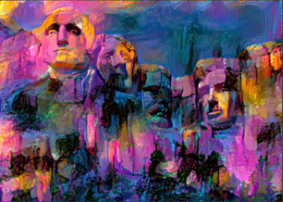

<h1 align="center">Neural Style Transfer</h1>

    </img>

Using Deep Neural Networks to reproduce an Image with a new Artistic Style

***
## What is Neural Style Transfer?

Style transfer is the technique of recomposing images in the style of other images. Achieving this task using a Convolutional Neural Network was popularized by [this paper](https://arxiv.org/pdf/1508.06576.pdf) by Leon A. Gatys, Alexander S. Ecker & Matthias Bethge.

Basically, it involves taking  two images as inputs :
- __Content image__ will determine how the generated image will look like.
- __Style image__ will give the style (or general texture) to the generated image.

The output image is the generated image that will have the content of the content image and the style of the style image.

## Implementation in PyTorch:

This project is an implementation of the Neural Style Transfer technique using some convolutional layers of the pretrained VGG Network (as mentioned in [the paper]((https://arxiv.org/pdf/1508.06576.pdf))) in PyTorch.

We define two loss metrics, one for the content (DC) and one for the style (DS). DC measures how different the content is between two images while DS measures how different the style is between two images. The output image is transformed so as to minimize both its content-loss with the content-image and its style-loss with the style-image.

[Here](./NeuralStyleTransfer.ipynb) is the IPython Notebook containing this implementation.

## Results:

Here are some results of the Neural Style Transfer:

| Content Image | Style Image | Output Image |
| :--: | :--: | :--: |
|  |  |  [Animation](results/Rushmore_PixelChinaMountains.gif) |
|  |  |  [Animation](results/Tezan_TheScream.gif) |
|  |  |  [Animation](results/Waterfall_AbstractSplash.gif) |
|  |  |  [Animation](results/Konark_Picasso.gif) |

***

Created with :heart: by <a href="https://www.linkedin.com/in/tezan-sahu/">Tezan Sahu</a>

